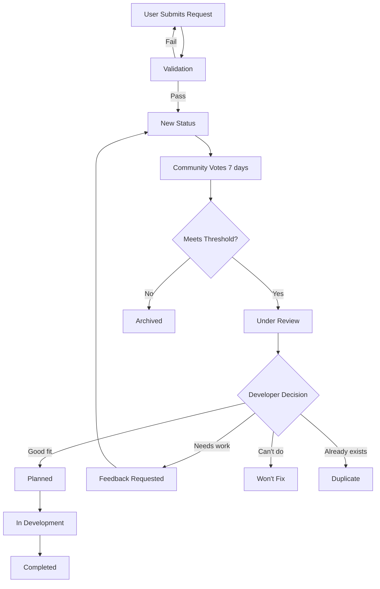

# Feature Request System

## Table of Contents
1. [System Overview](#system-overview)
2. [Design Philosophy](#design-philosophy)
3. [Request Submission Process](#request-submission-process)
4. [Voting & Prioritization](#voting--prioritization)
5. [Feature Categories](#feature-categories)
6. [Community Moderation](#community-moderation)
7. [Developer Response & Implementation](#developer-response--implementation)
8. [Tier-Specific Features](#tier-specific-features)
9. [UI Implementation](#ui-implementation)
10. [Technical Architecture](#technical-architecture)
11. [Implementation Strategy](#implementation-strategy)
12. [Balancing Considerations](#balancing-considerations)
13. [Open Questions & Future Enhancements](#open-questions--future-enhancements)
14. [Summary](#summary)

---

## System Overview

The **Feature Request System** empowers players to suggest features, vote on community ideas, and track development progress transparently. Unlike generic feedback forms, this system creates a public roadmap where players see their voices directly influence the game's evolution.

### Core Concepts

- **Democratic Voting**: Players vote on feature requests, surfacing community priorities
- **Transparent Roadmap**: Public visibility into what's planned, in development, and completed
- **Developer Engagement**: Developers respond to requests, explain decisions, provide updates
- **Status Tracking**: Each request has clear status (New → Under Review → Planned → In Development → Completed → Won't Fix)
- **Tier-Based Participation**: Free tier can submit/vote, Premium gets more votes, Subscription gets priority responses

### Value Proposition

**For Players**:
- Direct influence on game development
- Transparency into what features are coming
- Community validation of their ideas (upvotes)
- Recognition when their feature is implemented
- Sense of ownership in game's direction

**For Business**:
- Free market research (community tells us what they want)
- Builds player investment in game's success
- Reduces churn (players stay to see their features implemented)
- Drives upgrades (Subscription = priority feature consideration)
- Creates authentic engagement (not just consumption)
- Generates marketing content (feature implementation announcements)

### Key Features

1. **In-Game Submission**: Submit feature requests directly from game client
2. **Community Voting**: Upvote/downvote requests (Premium/Subscription get more votes)
3. **Public Roadmap**: See what's planned, in development, and recently shipped
4. **Developer Updates**: Developers comment on requests, explain status changes
5. **Implementation Credits**: Players credited when their feature ships
6. **Category Organization**: Browse by category (Gameplay, UI/UX, Social, etc.)
7. **Trending Requests**: See what's hot in the community right now
8. **Personal Dashboard**: Track your submitted requests and voted requests

---

## Design Philosophy

The Feature Request System must balance player empowerment with realistic expectations and development priorities.

### Core Principles

#### 1. Transparent, Not Misleading

**Problem**: Players submit ideas that never get implemented, feel ignored.

**Solution**:
- **Clear status transitions**: Every request moves through defined states
- **Developer responses required**: Explain why requests are accepted/rejected
- **Realistic timelines**: Don't promise features we can't deliver
- **Honest communication**: "This is technically infeasible" better than silence

**Status Flow**:
```
New → Under Review → [Planned / Won't Fix / Duplicate]
                ↓
          In Development
                ↓
            Completed
```

**Developer Commitments**:
- All requests in "Under Review" get response within 14 days
- "Planned" requests get target release estimate (Sprint X, Q2 2025, etc.)
- "In Development" requests get weekly progress updates
- "Won't Fix" requests get detailed explanation why

---

#### 2. Community-Driven, Not Mob Rule

**Problem**: Popular vote doesn't always align with good game design.

**Solution**:
- **Developers have final say**: Votes inform but don't dictate
- **Design expertise matters**: Explain why popular requests might hurt game
- **Vision alignment**: Requests must fit game's core philosophy
- **Balance considerations**: Even popular features get balanced implementation

**Example**:
```
Request: "Add pay-to-win weapons for $50"
Votes: 500 upvotes (from whales)

Developer Response:
"While we appreciate the engagement, this request conflicts with our
core philosophy of fair gameplay. We won't implement pay-to-win mechanics
as they would harm the majority of our player base and compromise
the game's integrity. Instead, we're exploring cosmetic monetization
that doesn't affect gameplay balance."

Status: Won't Fix
```

---

#### 3. Actionable, Not Vague

**Problem**: Vague requests ("Make game better") are impossible to implement.

**Solution**:
- **Submission templates**: Guide players to provide details
- **Required fields**: Problem statement, proposed solution, expected benefit
- **Community refinement**: Comments allow clarification and iteration
- **Developer questions**: Developers can request more details before evaluation

**Bad vs Good Requests**:
```
❌ Bad: "Game is too hard"
✅ Good: "Wave 20 difficulty spike is too steep for casual players.
         Suggestion: Add difficulty selector or gradual scaling curve.
         Benefit: Improves retention for 60% of players who quit at Wave 20."

❌ Bad: "Add more content"
✅ Good: "Add 5 new character types (Tank, Support, Speedster, Sniper, Berserker)
         each with unique abilities. This increases build diversity and
         replay value for players who've unlocked existing characters."
```

---

#### 4. Rewarding, Not Thankless

**Problem**: Players submit great ideas, get no recognition.

**Solution**:
- **Implementation credits**: "Feature suggested by PlayerName"
- **Achievement unlocks**: "Feature Contributor" achievement for implemented suggestions
- **Scrap rewards**: 500-5,000 scrap for implemented features
- **Hall of Fame**: "Top Contributors" leaderboard
- **In-game monuments**: Easter eggs crediting major contributors

**Recognition Tiers**:
| Impact | Recognition |
|--------|-------------|
| Minor tweak (UI improvement) | 500 scrap + comment credit |
| Medium feature (new item) | 1,500 scrap + achievement + patch notes credit |
| Major feature (new system) | 5,000 scrap + unique title + in-game easter egg |

---

#### 5. Inclusive, Not Elitist

**Problem**: Only loudest voices or biggest spenders get heard.

**Solution**:
- **Free tier can submit and vote**: Everyone has a voice
- **Limit on votes, not submissions**: Prevent vote manipulation
- **Diverse categories**: Ensure hardcore, casual, social, competitive players all represented
- **Explicit equity**: "We're specifically looking for ideas that help new players"

**Vote Allocation**:
- Free: 5 votes/week (enough to express preferences)
- Premium: 10 votes/week (more influence)
- Subscription: 20 votes/week + priority flag (maximum influence)

**Category Balance**:
Ensure roadmap addresses all player types:
- 30% Gameplay features (combat, progression)
- 20% Social features (trading cards, community)
- 20% Quality of life (UI/UX improvements)
- 15% Content (new characters, items, events)
- 15% Experimental (innovative ideas)

---

## Request Submission Process

### Submission Form

**Fields**:
1. **Title** (required, 10-100 characters)
   - Clear, descriptive one-liner
   - Example: "Add character loadout presets"

2. **Category** (required, dropdown)
   - Gameplay, UI/UX, Social, Content, Bug Fix, Balance, Other

3. **Description** (required, 50-1000 characters)
   - What problem does this solve?
   - How would it work?
   - Why would players want this?

4. **Mockups/Examples** (optional, image upload)
   - Screenshots, sketches, reference images
   - Limited to 3 images, max 5MB each

5. **Priority** (required, player perspective)
   - Critical (game is broken without this)
   - High (significantly improves experience)
   - Medium (nice to have)
   - Low (would be cool but not essential)

6. **Tags** (optional, multi-select)
   - Beginner-friendly, Veteran, Competitive, Casual, Social, Solo, etc.

**Validation**:
```gdscript
func validate_submission(request: FeatureRequest) -> ValidationResult:
    var errors = []

    # Title length
    if request.title.length() < 10:
        errors.append("Title must be at least 10 characters")
    if request.title.length() > 100:
        errors.append("Title must be under 100 characters")

    # Description length
    if request.description.length() < 50:
        errors.append("Description must be at least 50 characters (provide details!)")

    # Profanity filter
    if contains_profanity(request.title) or contains_profanity(request.description):
        errors.append("Please keep requests professional")

    # Spam detection
    if is_duplicate_recent(request.title):
        errors.append("A similar request was submitted recently. Try searching first.")

    # Rate limiting
    var user_submissions_today = get_submission_count_today(request.user_id)
    if user_submissions_today >= get_daily_limit(request.user_tier):
        errors.append("Daily submission limit reached. Try again tomorrow.")

    if errors.is_empty():
        return ValidationResult.success()
    else:
        return ValidationResult.failure(errors)
```

**Rate Limits**:
- Free: 2 submissions/day, 10/week
- Premium: 5 submissions/day, 25/week
- Subscription: 10 submissions/day, 50/week

**Purpose**: Prevent spam while allowing genuine engagement.

---

### Submission Lifecycle



**Thresholds**:
- Minimum votes to reach "Under Review": 50 upvotes
- Time window: 7 days in "New" status before archived if under threshold
- Exception: Subscription users can flag 1 request/month for priority review (bypasses threshold)

---

## Voting & Prioritization

### Voting Mechanics

**Vote Types**:
- **Upvote** (+1): I want this feature
- **Downvote** (-1): I don't want this feature (or it's harmful)
- **Neutral** (0): I don't care either way

**Vote Weight**:
- Free: 1 vote = 1 point
- Premium: 1 vote = 1.5 points
- Subscription: 1 vote = 2 points

**Rationale**: Paying users demonstrate commitment, their preferences weighted higher.

**Vote Budget**:
- Free: 5 active votes (can change votes to redistribute)
- Premium: 10 active votes
- Subscription: 20 active votes

**Changing Votes**: Players can withdraw votes and reallocate anytime.

---

### Prioritization Algorithm

**Score Calculation**:
```gdscript
func calculate_priority_score(request: FeatureRequest) -> float:
    # Base score from votes
    var vote_score = request.upvotes - request.downvotes

    # Apply vote weights (Subscription votes count more)
    var weighted_score = 0.0
    for vote in request.votes:
        match vote.user_tier:
            UserTier.FREE:
                weighted_score += vote.value * 1.0
            UserTier.PREMIUM:
                weighted_score += vote.value * 1.5
            UserTier.SUBSCRIPTION:
                weighted_score += vote.value * 2.0

    # Time decay (prevent old requests from dominating)
    var days_old = (Time.get_unix_time_from_system() - request.created_at) / 86400.0
    var decay_factor = 1.0 / (1.0 + days_old * 0.1)

    # Category bonus (encourage diversity)
    var category_bonus = get_category_bonus(request.category)

    # Developer interest multiplier (devs can flag interesting requests)
    var dev_multiplier = 1.0
    if request.has_developer_interest:
        dev_multiplier = 1.5

    var final_score = weighted_score * decay_factor * category_bonus * dev_multiplier

    return final_score
```

**Category Bonus**:
- If category is underrepresented in roadmap, boost score by 1.3x
- Ensures diverse feature development, not just popular category spam

---

### Trending Algorithm

**What Makes a Request "Trending"?**:
- Recent votes (within last 24 hours)
- Velocity (votes per hour)
- Comment activity
- Developer attention (comments from devs)

```gdscript
func calculate_trending_score(request: FeatureRequest) -> float:
    var now = Time.get_unix_time_from_system()

    # Votes in last 24 hours
    var recent_votes = request.votes.filter(func(v): return now - v.timestamp < 86400)
    var vote_velocity = recent_votes.size() / 24.0  # Votes per hour

    # Comment activity in last 24 hours
    var recent_comments = request.comments.filter(func(c): return now - c.timestamp < 86400)
    var comment_velocity = recent_comments.size() / 24.0

    # Developer engagement
    var has_dev_comment = request.comments.any(func(c): return c.user_is_developer)
    var dev_bonus = 10.0 if has_dev_comment else 0.0

    var trending_score = (vote_velocity * 2.0) + (comment_velocity * 1.0) + dev_bonus

    return trending_score
```

**Trending Display**: Top 10 trending requests shown prominently in UI.

---

## Feature Categories

Requests organized into 8 categories to ensure balanced development.

### 1. Gameplay (Combat, Mechanics, Balance)

**Examples**:
- "Add dodge roll mechanic with i-frames"
- "Increase enemy variety in later waves"
- "Balance Glass Cannon playstyle (too strong)"
- "Add status effects (burn, freeze, poison)"

**Review Priority**: High (core game experience)

---

### 2. UI/UX (Interface, Quality of Life)

**Examples**:
- "Add character loadout presets"
- "Show DPS meter in real-time"
- "Improve shop item comparison"
- "Add colorblind mode"

**Review Priority**: Medium-High (frequently requested, often quick wins)

---

### 3. Content (Characters, Items, Events)

**Examples**:
- "Add 5 new character types"
- "Create legendary weapon tier"
- "Add Halloween event"
- "More boss variety"

**Review Priority**: Medium (requires art/design resources)

---

### 4. Social (Community, Multiplayer, Sharing)

**Examples**:
- "Add co-op mode (2 players)"
- "Guild/clan system"
- "In-game chat"
- "Share builds with friends"

**Review Priority**: Medium (large undertaking, high engagement if done well)

---

### 5. Progression (Unlocks, Rewards, Meta)

**Examples**:
- "Add prestige system (reset for bonuses)"
- "More perk variety"
- "Account-wide progression bonuses"
- "Seasonal battle pass"

**Review Priority**: High (retention driver)

---

### 6. Performance (Optimization, Bug Fixes)

**Examples**:
- "Reduce lag during enemy swarms"
- "Fix crash on Wave 30+"
- "Optimize battery usage on mobile"
- "Reduce loading times"

**Review Priority**: Critical (quality baseline)

---

### 7. Monetization (Premium Features, Value)

**Examples**:
- "Add cosmetic-only shop (no pay-to-win)"
- "Bundle deals for items"
- "Gift Premium to friends"
- "Reduce Black Market prices"

**Review Priority**: High (revenue impact, player sentiment)

---

### 8. Accessibility (Colorblind, Controls, etc.)

**Examples**:
- "Add colorblind mode"
- "Larger UI text option"
- "One-handed mode for mobile"
- "Better controller support" ← Already planned!

**Review Priority**: High (inclusive design, underserved segment)

---

## Community Moderation

### Self-Moderation Tools

**Flagging**:
- Players can flag requests as:
  - Spam
  - Duplicate
  - Offensive
  - Off-topic

- Flagged requests reviewed by moderators within 24 hours

**Duplicate Detection**:
- When submitting, show similar existing requests
- Encourage upvoting existing request instead of creating duplicate

**Community Guidelines**:
```
✅ Do:
- Be specific and constructive
- Search for existing requests first
- Provide examples or mockups
- Explain the problem your feature solves

❌ Don't:
- Submit vague requests ("make game better")
- Spam or duplicate requests
- Use offensive language
- Request pay-to-win features
- Demand immediate implementation
```

---

### Moderator Actions

**Moderator Roles**:
- **Community Moderators**: Volunteers from player base, can merge duplicates, flag spam
- **Developer Moderators**: Team members, can change status, post official updates

**Actions**:
1. **Merge Duplicates**: Combine duplicate requests, transfer votes
2. **Archive Spam**: Remove spam, ban repeat offenders
3. **Edit for Clarity**: Minor edits to improve request clarity (with user permission)
4. **Add Official Tags**: "Developer Reviewing", "Planned for Q2", "Won't Fix - Explained"

**Audit Log**: All moderator actions logged publicly for transparency.

---

## Developer Response & Implementation

### Response SLAs

**Service Level Agreements**:
| Status | Response Time | Update Frequency |
|--------|---------------|------------------|
| New | N/A (community voting phase) | N/A |
| Under Review | 14 days (initial response) | N/A |
| Planned | 30 days (target release estimate) | Monthly updates |
| In Development | 7 days (accepted into sprint) | Weekly updates |
| Completed | 1 day (release announcement) | N/A |
| Won't Fix | 14 days (explanation required) | N/A |

**Subscription Priority**: Subscription users get response within 7 days (not 14).

---

### Status Explanations

#### "Planned"
```
Developer Comment:
"Great suggestion! This aligns with our Q2 roadmap. We're planning to
implement character loadout presets as part of the UI overhaul in Sprint 18
(estimated: April 2025). We'll post weekly updates once development starts.

Thanks for the detailed mockups - they'll be very helpful!"

Status: Planned
Target Release: Q2 2025 (Sprint 18)
```

#### "Won't Fix"
```
Developer Comment:
"We appreciate the suggestion for pay-to-win weapons. However, this conflicts
with our core design philosophy of fair gameplay. Adding pay-to-win mechanics
would create an unbalanced playing field and harm player trust.

Instead, we're exploring cosmetic monetization (character skins, emotes, borders)
that don't affect gameplay balance. We believe this approach respects all players
regardless of spending level.

We understand this isn't the answer you wanted, but we hope you appreciate
our commitment to fair gameplay."

Status: Won't Fix
Reason: Conflicts with design philosophy
```

#### "Needs More Info"
```
Developer Comment:
"Interesting idea! Can you clarify a few things?

1. How would the dodge roll work with controller support?
2. What's the cooldown you're envisioning?
3. Should i-frames apply to all damage or just projectiles?

Please update the request description with these details so we can properly
evaluate this. Thanks!"

Status: Under Review (Feedback Requested)
```

---

### Implementation Credits

**When Feature Ships**:
1. **Patch Notes Credit**:
   ```
   Version 1.5.0 - April 15, 2025

   New Features:
   • Character Loadout Presets (suggested by PlayerName #1234)
     - Save up to 5 loadouts per character
     - Quick-swap between builds in shop
     - Share loadouts via trading cards
   ```

2. **In-Game Notification**:
   ```
   🎉 Your Feature Was Implemented!

   "Character Loadout Presets" is now live in v1.5.0!

   Thanks for making Scrap Survivor better.

   Rewards:
   • 5,000 scrap
   • "Feature Contributor" achievement
   • "Innovator" title

   [View Patch Notes]
   ```

3. **Hall of Fame**:
   - Top contributors featured in-game
   - List of implemented features per player

4. **Easter Egg** (for major features):
   - Hidden NPC or item named after contributor
   - Example: "PlayerName's Wrench" item with flavor text crediting them

---

## Tier-Specific Features

### Free Tier

**Access**:
- ✅ Submit 2 requests/day, 10/week
- ✅ Vote on unlimited requests (5 active votes)
- ✅ Comment on requests
- ✅ View public roadmap
- ✅ Track your submissions

**Restrictions**:
- ❌ No priority review flag
- ❌ Limited vote weight (1x)
- ❌ Lower submission cap
- ❌ Slower developer response (14 days vs 7)

**Business Logic**: Free tier can participate fully, but influence is limited.

---

### Premium Tier ($9.99)

**Access**:
- ✅ All Free features
- ✅ Submit 5 requests/day, 25/week
- ✅ 10 active votes with 1.5x weight
- ✅ "Premium Supporter" badge on submissions
- ✅ Access to Premium-only feedback sessions (monthly Q&A)

**Business Logic**: Premium users demonstrate commitment, get amplified voice.

---

### Subscription Tier ($4.99/month)

**Access**:
- ✅ All Premium features
- ✅ Submit 10 requests/day, 50/week
- ✅ 20 active votes with 2x weight
- ✅ Priority review flag (1/month, bypasses vote threshold)
- ✅ Guaranteed developer response within 7 days
- ✅ Early access to planned features (beta testing)
- ✅ "Subscriber" badge on submissions (visual prominence)
- ✅ Direct feedback channel (Discord role, monthly video call)

**Business Logic**: Subscribers are VIPs, get maximum influence and direct access to dev team.

---

### Tier Comparison Table

| Feature | Free | Premium | Subscription |
|---------|------|---------|--------------|
| Submissions per day | 2 | 5 | 10 |
| Submissions per week | 10 | 25 | 50 |
| Active votes | 5 | 10 | 20 |
| Vote weight | 1x | 1.5x | 2x |
| Developer response time | 14 days | 14 days | 7 days |
| Priority review flag | ❌ | ❌ | ✅ (1/month) |
| Beta testing access | ❌ | ❌ | ✅ |
| Feedback sessions | ❌ | Monthly Q&A | Monthly + Video Calls |
| Badge on submissions | ❌ | "Premium" | "Subscriber" |

---

## UI Implementation

### Feature Request Hub (Main Screen)

**Layout**:
```
┌──────────────────────────────────────────────────────────────┐
│  💡 Feature Requests                                  [×]    │
├────────────────────┬─────────────────────────────────────────┤
│                    │                                         │
│  [+ New Request]   │  🔥 TRENDING NOW                        │
│                    │                                         │
│  FILTERS           │  1. Character Loadout Presets          │
│  ☑ All Statuses    │     ⬆️ 342  💬 28  🕐 2 days ago       │
│  ☐ Planned         │                                         │
│  ☐ In Development  │  2. Co-op Mode (2 Players)             │
│  ☐ Under Review    │     ⬆️ 289  💬 45  🕐 5 hours ago      │
│                    │                                         │
│  CATEGORIES        │  3. Dodge Roll Mechanic                │
│  ☑ All             │     ⬆️ 156  💬 12  🕐 1 day ago        │
│  ☐ Gameplay        │                                         │
│  ☐ UI/UX           │  ─────────────────────────────────      │
│  ☐ Content         │                                         │
│  ☐ Social          │  📋 TOP REQUESTED                       │
│  ☐ Progression     │                                         │
│  ☐ Performance     │  1. ⬆️ 1,245 | Character Loadouts      │
│  ☐ Monetization    │     Status: Planned (Q2 2025)          │
│  ☐ Accessibility   │                                         │
│                    │  2. ⬆️ 892 | More Boss Variety          │
│  SORT BY           │     Status: Under Review               │
│  ● Trending        │                                         │
│  ○ Most Votes      │  3. ⬆️ 743 | Prestige System            │
│  ○ Recent          │     Status: In Development (Sprint 16) │
│  ○ My Requests     │                                         │
│                    │  [View All Requests]                    │
│  MY STATS          │                                         │
│  Submissions: 5    │                                         │
│  Implemented: 1    │                                         │
│  Active Votes: 3/5 │                                         │
│                    │                                         │
└────────────────────┴─────────────────────────────────────────┘
```

**Implementation**:
```gdscript
# UI/FeatureRequestHub.gd
extends Panel

@onready var new_request_button = $LeftPanel/NewRequestButton
@onready var trending_list = $RightPanel/Trending
@onready var top_requested_list = $RightPanel/TopRequested
@onready var filter_checkboxes = $LeftPanel/Filters
@onready var sort_buttons = $LeftPanel/SortBy

func _ready():
    load_trending_requests()
    load_top_requests()
    new_request_button.pressed.connect(_on_new_request_pressed)

func load_trending_requests():
    var trending = FeatureRequestService.get_trending(limit = 3)

    for request in trending:
        var card = create_mini_card(request)
        trending_list.add_child(card)

func load_top_requests():
    var top = FeatureRequestService.get_top_voted(limit = 3)

    for request in top:
        var card = create_status_card(request)
        top_requested_list.add_child(card)

func _on_new_request_pressed():
    FeatureRequestSubmissionDialog.open()
```

---

### New Request Submission Dialog

**Visual**:
```
┌─────────────────────────────────────────────────────────┐
│  Submit Feature Request                          [×]    │
├─────────────────────────────────────────────────────────┤
│                                                         │
│  Title *                                                │
│  ┌─────────────────────────────────────────────────┐   │
│  │ Add character loadout presets                   │   │
│  └─────────────────────────────────────────────────┘   │
│  10-100 characters                                      │
│                                                         │
│  Category *                                             │
│  [ UI/UX ▼]                                             │
│                                                         │
│  Description *                                          │
│  ┌─────────────────────────────────────────────────┐   │
│  │ Allow players to save 5 loadout presets per    │   │
│  │ character. This would speed up build testing   │   │
│  │ and let players switch between strategies      │   │
│  │ quickly. Example: "Tank Build", "DPS Build",   │   │
│  │ "Boss Killer Build". Could also share loadouts │   │
│  │ via trading cards.                              │   │
│  └─────────────────────────────────────────────────┘   │
│  50-1000 characters | 237/1000                          │
│                                                         │
│  Priority (from your perspective) *                     │
│  ( ) Critical  (•) High  ( ) Medium  ( ) Low            │
│                                                         │
│  Tags (optional)                                        │
│  [Veteran] [Quality of Life] [UI]                      │
│                                                         │
│  Mockups (optional)                                     │
│  [Upload Image] [Upload Image] [Upload Image]          │
│                                                         │
│  ───────────────────────────────────────────────────    │
│                                                         │
│  Submissions today: 1/2 (Free tier)                    │
│  💎 Premium: 5/day | Subscription: 10/day               │
│                                                         │
│            [Cancel]  [Submit Request]                   │
│                                                         │
└─────────────────────────────────────────────────────────┘
```

**Implementation**:
```gdscript
# UI/FeatureRequestSubmissionDialog.gd
extends AcceptDialog

@onready var title_input = $VBox/TitleInput
@onready var category_dropdown = $VBox/CategoryDropdown
@onready var description_input = $VBox/DescriptionInput
@onready var priority_buttons = $VBox/PriorityButtons
@onready var submit_button = $VBox/Actions/SubmitButton

func _ready():
    submit_button.pressed.connect(_on_submit_pressed)

func _on_submit_pressed():
    var request = FeatureRequest.new({
        "title": title_input.text,
        "category": category_dropdown.selected,
        "description": description_input.text,
        "priority": get_selected_priority(),
        "user_id": UserService.get_current_user_id()
    })

    # Validate
    var validation = FeatureRequestService.validate_submission(request)
    if not validation.success:
        show_errors(validation.errors)
        return

    # Submit
    var result = await FeatureRequestService.submit_request(request)

    if result.success:
        show_success_notification()
        hide()
    else:
        show_error(result.error_message)

func show_success_notification():
    NotificationService.show({
        "title": "Feature Request Submitted!",
        "message": "Your request is now open for community voting.\nYou'll be notified of updates.",
        "icon": "success"
    })
```

---

### Feature Request Detail View

**Visual**:
```
┌───────────────────────────────────────────────────────────────┐
│  Character Loadout Presets                             [×]    │
├───────────────────────────────────────────────────────────────┤
│                                                               │
│  Status: 🟢 Planned (Q2 2025, Sprint 18)                      │
│  Category: UI/UX                                              │
│  Submitted by: PlayerName #1234 | 15 days ago                │
│                                                               │
│  ⬆️ 1,245  ⬇️ 23  |  Your vote: ⬆️  [Change Vote]            │
│                                                               │
│  ────────────────────────────────────────────────────────     │
│                                                               │
│  DESCRIPTION                                                  │
│                                                               │
│  Allow players to save 5 loadout presets per character.      │
│  This would speed up build testing and let players switch    │
│  between strategies quickly.                                 │
│                                                               │
│  Example presets:                                            │
│  • "Tank Build" (high HP, armor)                             │
│  • "DPS Build" (damage focus)                                │
│  • "Boss Killer Build" (single-target)                       │
│                                                               │
│  Could also share loadouts via trading cards!                │
│                                                               │
│  [Mockup Image]                                              │
│                                                               │
│  ────────────────────────────────────────────────────────     │
│                                                               │
│  💬 DEVELOPER RESPONSE                                        │
│  Developer Alan | 10 days ago                                │
│                                                               │
│  "Great suggestion! This aligns perfectly with our Q2        │
│  roadmap for UI improvements. We're planning to implement    │
│  this in Sprint 18 (estimated April 2025).                   │
│                                                               │
│  Your mockups are super helpful - we'll use these as         │
│  reference during design. We'll post weekly updates once     │
│  development starts.                                         │
│                                                               │
│  Thanks for the detailed writeup!"                           │
│                                                               │
│  ────────────────────────────────────────────────────────     │
│                                                               │
│  💬 COMMENTS (28)                                             │
│                                                               │
│  PlayerTwo #5678 | 14 days ago                               │
│  "This would be amazing! I waste so much time re-equipping   │
│  items between runs."                                        │
│  ⬆️ 45  ⬇️ 2                                                  │
│                                                               │
│  VeteranPlayer #9999 | 13 days ago                           │
│  "Suggestion: Also allow importing loadouts from trading     │
│  cards. That would be perfect!"                              │
│  ⬆️ 38  ⬇️ 1                                                  │
│                                                               │
│  [Load More Comments]                                         │
│                                                               │
│  [Add Comment]                                                │
│                                                               │
└───────────────────────────────────────────────────────────────┘
```

---

### Public Roadmap View

**Visual**:
```
┌──────────────────────────────────────────────────────────┐
│  🗺️ Public Roadmap                                 [×]   │
├──────────────────────────────────────────────────────────┤
│                                                          │
│  Q2 2025 (April - June)                                  │
│                                                          │
│  Sprint 16 (Apr 1-14)                                    │
│  🟢 In Development:                                      │
│    • Prestige System (⬆️ 743)                           │
│    • More Boss Variety (⬆️ 892)                         │
│    • Performance Optimization (⬆️ 234)                  │
│                                                          │
│  Sprint 17 (Apr 15-28)                                   │
│  🔵 Planned:                                             │
│    • Dodge Roll Mechanic (⬆️ 156)                       │
│    • Colorblind Mode (⬆️ 312)                           │
│                                                          │
│  Sprint 18 (Apr 29 - May 12)                             │
│  🔵 Planned:                                             │
│    • Character Loadout Presets (⬆️ 1,245)               │
│    • DPS Meter UI (⬆️ 421)                              │
│                                                          │
│  ────────────────────────────────────────────────────     │
│                                                          │
│  Q3 2025 (July - September)                              │
│                                                          │
│  🟡 Under Review:                                        │
│    • Co-op Mode (⬆️ 289) - Requires major architecture  │
│    • Guild System (⬆️ 178) - Evaluating scope           │
│                                                          │
│  ────────────────────────────────────────────────────     │
│                                                          │
│  Recently Completed                                      │
│                                                          │
│  ✅ v1.4.0 (March 15, 2025)                              │
│    • Trading Cards System                                │
│    • Black Market                                        │
│    • Controller Support                                  │
│                                                          │
│  ✅ v1.3.0 (February 1, 2025)                            │
│    • Perk System                                         │
│    • Character Service                                   │
│                                                          │
└──────────────────────────────────────────────────────────┘
```

---

## Technical Architecture

### Database Schema

```sql
-- Feature requests
CREATE TABLE feature_requests (
  id UUID PRIMARY KEY DEFAULT uuid_generate_v4(),
  user_id UUID REFERENCES user_accounts(id) NOT NULL,

  -- Content
  title VARCHAR(100) NOT NULL,
  description TEXT NOT NULL,
  category VARCHAR(30) NOT NULL,
  priority VARCHAR(20) NOT NULL,  -- User's stated priority
  tags VARCHAR(50)[],

  -- Status
  status VARCHAR(30) DEFAULT 'new',  -- new, under_review, planned, in_development, completed, wont_fix, duplicate
  developer_priority INT,  -- Internal priority score (calculated)
  target_release VARCHAR(50),  -- "Q2 2025", "Sprint 18", etc.

  -- Voting
  upvotes INT DEFAULT 0,
  downvotes INT DEFAULT 0,
  weighted_score FLOAT DEFAULT 0.0,

  -- Engagement
  view_count INT DEFAULT 0,
  comment_count INT DEFAULT 0,

  -- Moderation
  flagged_count INT DEFAULT 0,
  is_archived BOOLEAN DEFAULT false,
  duplicate_of UUID REFERENCES feature_requests(id),

  -- Timestamps
  created_at TIMESTAMPTZ DEFAULT NOW(),
  updated_at TIMESTAMPTZ DEFAULT NOW(),
  reviewed_at TIMESTAMPTZ,
  completed_at TIMESTAMPTZ
);

-- Votes on feature requests
CREATE TABLE feature_request_votes (
  id UUID PRIMARY KEY DEFAULT uuid_generate_v4(),
  request_id UUID REFERENCES feature_requests(id) NOT NULL,
  user_id UUID REFERENCES user_accounts(id) NOT NULL,

  vote INT NOT NULL,  -- 1 (upvote), -1 (downvote), 0 (neutral/withdrawn)
  vote_weight FLOAT NOT NULL,  -- 1.0 (free), 1.5 (premium), 2.0 (subscription)

  created_at TIMESTAMPTZ DEFAULT NOW(),
  updated_at TIMESTAMPTZ DEFAULT NOW(),

  UNIQUE(request_id, user_id)
);

-- Comments on feature requests
CREATE TABLE feature_request_comments (
  id UUID PRIMARY KEY DEFAULT uuid_generate_v4(),
  request_id UUID REFERENCES feature_requests(id) NOT NULL,
  user_id UUID REFERENCES user_accounts(id) NOT NULL,

  content TEXT NOT NULL,
  is_developer_comment BOOLEAN DEFAULT false,
  is_official_update BOOLEAN DEFAULT false,

  upvotes INT DEFAULT 0,
  downvotes INT DEFAULT 0,

  created_at TIMESTAMPTZ DEFAULT NOW(),
  updated_at TIMESTAMPTZ DEFAULT NOW()
);

-- Status history (audit trail)
CREATE TABLE feature_request_status_history (
  id UUID PRIMARY KEY DEFAULT uuid_generate_v4(),
  request_id UUID REFERENCES feature_requests(id) NOT NULL,

  old_status VARCHAR(30),
  new_status VARCHAR(30) NOT NULL,
  developer_comment TEXT,
  changed_by UUID REFERENCES user_accounts(id),

  created_at TIMESTAMPTZ DEFAULT NOW()
);

-- User submission limits (rate limiting)
CREATE TABLE user_submission_limits (
  user_id UUID PRIMARY KEY REFERENCES user_accounts(id),
  submissions_today INT DEFAULT 0,
  submissions_this_week INT DEFAULT 0,
  last_submission_date DATE DEFAULT CURRENT_DATE,
  last_week_reset DATE DEFAULT CURRENT_DATE
);
```

---

### Service Layer

```gdscript
# services/FeatureRequestService.gd
class_name FeatureRequestService
extends Node

signal request_submitted(request: FeatureRequest)
signal request_status_changed(request_id: String, new_status: String)
signal vote_changed(request_id: String, user_id: String)

func submit_request(request: FeatureRequest) -> Result:
    # Validate
    var validation = validate_submission(request)
    if not validation.success:
        return Result.failure(validation.errors)

    # Check rate limits
    if not check_rate_limit(request.user_id):
        return Result.failure("Daily submission limit reached")

    # Insert into database
    var result = await SupabaseService.insert("feature_requests", {
        "user_id": request.user_id,
        "title": request.title,
        "description": request.description,
        "category": request.category,
        "priority": request.priority,
        "tags": request.tags,
        "status": "new"
    })

    if result.success:
        emit_signal("request_submitted", request)
        increment_submission_count(request.user_id)
        return Result.success(result.data)
    else:
        return Result.failure("Database error")

func vote_on_request(request_id: String, user_id: String, vote: int):
    # Check if user has votes available
    var available_votes = get_available_votes(user_id)
    if available_votes <= 0 and not has_voted(request_id, user_id):
        return Result.failure("No votes available")

    # Get vote weight based on tier
    var tier = UserService.get_user_tier(user_id)
    var weight = get_vote_weight(tier)

    # Upsert vote
    await SupabaseService.upsert("feature_request_votes", {
        "request_id": request_id,
        "user_id": user_id,
        "vote": vote,
        "vote_weight": weight
    }, ["request_id", "user_id"])

    # Update request vote counts
    update_vote_counts(request_id)

    emit_signal("vote_changed", request_id, user_id)

func get_vote_weight(tier: UserTier) -> float:
    match tier:
        UserTier.FREE:
            return 1.0
        UserTier.PREMIUM:
            return 1.5
        UserTier.SUBSCRIPTION:
            return 2.0

func get_available_votes(user_id: String) -> int:
    var tier = UserService.get_user_tier(user_id)
    var max_votes = get_max_votes(tier)

    var active_votes = await SupabaseService.count(
        "feature_request_votes",
        "user_id = '%s' AND vote != 0" % user_id
    )

    return max_votes - active_votes

func get_max_votes(tier: UserTier) -> int:
    match tier:
        UserTier.FREE:
            return 5
        UserTier.PREMIUM:
            return 10
        UserTier.SUBSCRIPTION:
            return 20

func change_status(request_id: String, new_status: String, developer_comment: String):
    # Update request status
    await SupabaseService.update("feature_requests", {
        "status": new_status,
        "reviewed_at": Time.get_unix_time_from_system()
    }, "id = '%s'" % request_id)

    # Log status change
    await SupabaseService.insert("feature_request_status_history", {
        "request_id": request_id,
        "old_status": get_current_status(request_id),
        "new_status": new_status,
        "developer_comment": developer_comment,
        "changed_by": UserService.get_current_user_id()
    })

    # Notify requester
    notify_status_change(request_id, new_status, developer_comment)

    emit_signal("request_status_changed", request_id, new_status)

func get_trending(limit: int = 10) -> Array[FeatureRequest]:
    # Query requests with high recent activity
    var query = """
        SELECT *,
               (SELECT COUNT(*) FROM feature_request_votes
                WHERE request_id = feature_requests.id
                AND created_at > NOW() - INTERVAL '24 hours') as recent_votes
        FROM feature_requests
        WHERE status IN ('new', 'under_review')
        ORDER BY recent_votes DESC, comment_count DESC
        LIMIT %d
    """ % limit

    var result = await SupabaseService.raw_query(query)
    return parse_requests(result.data)

func get_top_voted(limit: int = 10) -> Array[FeatureRequest]:
    var result = await SupabaseService.select(
        "feature_requests",
        "*",
        "ORDER BY weighted_score DESC LIMIT %d" % limit
    )

    return parse_requests(result.data)
```

---

## Implementation Strategy

### Phase 1: Core Infrastructure (Week 16 Day 1-2) - 2 days

**Goal**: Build feature request submission and storage.

**Tasks**:
1. Create database tables (feature_requests, votes, comments)
2. Implement FeatureRequestService with CRUD operations
3. Build submission form UI
4. Implement validation and rate limiting
5. Basic request display (list view)

**Deliverables**:
- Database migration scripts
- FeatureRequestService (300 lines)
- Submission dialog UI (200 lines)
- Request list view (150 lines)

**Testing**:
- Submit request, verify saves to database
- Test validation (too short, profanity, etc.)
- Verify rate limiting works

---

### Phase 2: Voting System (Week 16 Day 3) - 1 day

**Goal**: Implement voting mechanics and prioritization.

**Tasks**:
1. Build voting UI (upvote/downvote buttons)
2. Implement vote weight system (Free 1x, Premium 1.5x, Subscription 2x)
3. Create vote budget tracking
4. Build prioritization algorithm
5. Trending calculation

**Deliverables**:
- Voting UI (100 lines)
- Vote weight logic (50 lines)
- Prioritization algorithm (100 lines)

**Testing**:
- Vote on request, verify weight applied correctly
- Test vote budget limits
- Verify trending algorithm surfaces recent activity

---

### Phase 3: Status Management & Developer Tools (Week 16 Day 4-5) - 2 days

**Goal**: Build developer status management and response tools.

**Tasks**:
1. Create developer admin panel
2. Implement status transitions (new → planned → in development → completed)
3. Build developer comment system
4. Implement notification system (status changes)
5. Create public roadmap view

**Deliverables**:
- Developer admin panel (300 lines)
- Status management (150 lines)
- Notification system (100 lines)
- Roadmap view (200 lines)

**Testing**:
- Change status, verify requester notified
- Test roadmap displays correctly
- Verify developer comments show prominently

---

### Phase 4: Tier Differentiation & Features (Week 17 Day 1) - 1 day

**Goal**: Implement tier-specific features.

**Tasks**:
1. Add tier checking to submission limits
2. Implement Subscription priority review flag
3. Build tier comparison upsells
4. Create beta testing invitation system (Subscription)

**Deliverables**:
- Tier gating logic (100 lines)
- Priority review flag (50 lines)
- Upsell messaging (80 lines)

**Testing**:
- Test with Free/Premium/Subscription accounts
- Verify Subscription priority flag works
- Test submission limits enforced correctly

---

### Phase 5: Community Features (Week 17 Day 2) - 1 day

**Goal**: Add commenting, flagging, and moderation.

**Tasks**:
1. Build comment system (threaded comments)
2. Implement flagging/moderation
3. Add duplicate detection
4. Create moderator dashboard

**Deliverables**:
- Comment UI (200 lines)
- Flagging system (100 lines)
- Moderation dashboard (200 lines)

**Testing**:
- Post comment, verify displays
- Flag request as spam, verify moderator sees it
- Test duplicate detection

---

### Phase 6: Integration & Recognition (Week 17 Day 3) - 1 day

**Goal**: Integrate with achievements and recognition systems.

**Tasks**:
1. Create "Feature Contributor" achievement
2. Implement implementation credits (patch notes)
3. Build contributor Hall of Fame
4. Add scrap rewards for implemented features

**Deliverables**:
- Achievement integration (50 lines)
- Credit system (100 lines)
- Hall of Fame (100 lines)

**Testing**:
- Implement feature, verify credits appear in patch notes
- Verify achievement unlocks
- Test scrap reward granted

---

### Phase 7: Polish & Content (Week 17 Day 4) - 1 day

**Goal**: Polish UX and create initial content.

**Tasks**:
1. Seed database with example requests (from community/Discord)
2. Write community guidelines
3. Polish animations and transitions
4. Final QA pass
5. Create tutorial/help documentation

**Deliverables**:
- 20+ seed requests
- Community guidelines document
- Tutorial UI
- Polish improvements

**Testing**:
- Full user journey (submit → vote → comment → status change)
- User testing for clarity
- Verify guidelines are clear

---

### Timeline Summary

| Phase | Duration | Effort | Dependencies |
|-------|----------|--------|--------------|
| 1. Core Infrastructure | 2 days | 12 hours | SupabaseService |
| 2. Voting System | 1 day | 6 hours | Phase 1 |
| 3. Status & Developer Tools | 2 days | 12 hours | Phase 1-2 |
| 4. Tier Differentiation | 1 day | 6 hours | UserService, SubscriptionService |
| 5. Community Features | 1 day | 6 hours | Phase 1-3 |
| 6. Integration & Recognition | 1 day | 6 hours | AchievementService |
| 7. Polish & Content | 1 day | 6 hours | All previous |
| **Total** | **9 days** | **~54 hours** | - |

---

## Balancing Considerations

### Managing Expectations

**Problem**: Players expect all voted features to be implemented.

**Solution**:
- Clear communication: "Votes inform, don't dictate"
- Honest status explanations ("Won't Fix" with reasoning)
- Realistic timelines (don't promise Q2 if it's actually Q4)
- Celebrate small wins (even minor features get announced)

**Metrics to Track**:
- Implementation rate (% of "Planned" requests that ship)
- Average time from "Planned" to "Completed"
- Player satisfaction with transparency (survey)

---

### Preventing Spam

**Problem**: Players spam low-quality requests.

**Solution**:
- Rate limits (2-10 submissions/day based on tier)
- Minimum character counts (title 10+, description 50+)
- Duplicate detection (suggest existing requests)
- Community flagging + moderator review
- Temporary bans for repeat offenders

**Threshold**: <10% of requests flagged as spam (indicates healthy system)

---

### Vote Manipulation

**Problem**: Users create alt accounts to vote on own requests.

**Solution**:
- Require account age (7 days) to vote
- Require minimum playtime (5 hours) to vote
- Anomaly detection (same IP voting repeatedly)
- Vote weight system makes manipulation less effective (need Premium/Subscription alts)

---

### Developer Bandwidth

**Problem**: Can't implement all popular requests.

**Solution**:
- Be transparent about bandwidth ("We can implement ~3 features per sprint")
- Use roadmap to show what's already planned (prevent duplicate asks)
- Explain tradeoffs ("Implementing co-op would delay 5 other features")
- Celebrate small wins alongside big features

---

## Open Questions & Future Enhancements

### Open Questions

1. **Should feature requests affect game balance?**
   - Balance changes are contentious (nerfs make people angry)
   - Possible: Separate "balance feedback" from "feature requests"

2. **How to handle controversial features (e.g., PvP)?**
   - Some features are highly divisive (50% love, 50% hate)
   - Solution: Poll system for controversial ideas (not just votes)

3. **Should we do quarterly "community sprints"?**
   - Dedicate 1 sprint per quarter to top community requests
   - Pro: Guaranteed implementation of popular features
   - Con: Delays planned roadmap

4. **Should voting cost resources (scrap)?**
   - Pro: Prevents frivolous voting, demonstrates commitment
   - Con: Excludes free players, feels pay-to-influence

5. **How to credit multiple contributors for same idea?**
   - Often multiple players suggest same feature independently
   - Solution: Credit first submitter, acknowledge others in comments?

---

### Future Enhancements

#### 1. Live Voting Events (Post-MVP)

**Concept**: Monthly "Community Vote Day" where top 5 requests go head-to-head.

**Implementation**:
- 24-hour voting window
- Winning request gets prioritized in next sprint
- Live stream announcement of winner

**Engagement**: Creates event around community participation.

---

#### 2. Feature Request Bounties (Post-MVP)

**Concept**: Players pool scrap to "fund" features.

**Example**:
```
"Co-op Mode" - Community Bounty: 50,000 scrap
1,245 players contributed

If implemented, bounty distributed to contributors as thank-you reward.
```

**Business Logic**: Creates investment in feature success.

---

#### 3. Beta Testing Opt-In (Post-MVP)

**Concept**: Subscribers can opt into early access for in-development features.

**Implementation**:
- "In Development" features show [Join Beta] button for Subscribers
- Beta testers provide feedback before full release
- Beta testers get credited in patch notes

---

#### 4. Feature Request Trading Cards (Post-MVP)

**Concept**: Create trading cards for implemented features crediting contributors.

**Example**:
```
┌─────────────────────────┐
│  Character Loadouts     │
│  [Screenshot of feature]│
│                         │
│  Suggested by:          │
│  PlayerName #1234       │
│                         │
│  Implemented: v1.5.0    │
│  Apr 15, 2025           │
└─────────────────────────┘
```

**Social Value**: Immortalizes contributions, encourages sharing.

---

#### 5. Developer AMA Integration (Post-MVP)

**Concept**: Monthly Reddit/Discord AMA driven by feature requests.

**Implementation**:
- Top 10 "Under Review" requests discussed in AMA
- Developers explain feasibility, timelines, tradeoffs
- Recorded and archived for transparency

---

#### 6. AI-Powered Duplicate Detection (Post-MVP)

**Concept**: Use AI to detect semantic duplicates (not just keyword matches).

**Example**:
```
Submitted: "Add ability to save weapon combos"
AI Detects Similar: "Character loadout presets" (92% similarity)

Suggestion: "A similar request already exists. Would you like to
upvote that instead?"
```

---

## Summary

The **Feature Request System** empowers players to shape the game's evolution through democratic voting, transparent roadmaps, and direct developer engagement. By balancing community input with design expertise, the system creates authentic player investment while maintaining realistic expectations.

### Key Features

1. **In-Game Submission**: Players submit feature requests directly from game client with structured templates
2. **Democratic Voting**: Community upvotes/downvotes requests (Free: 5 votes, Premium: 10, Subscription: 20)
3. **Transparent Roadmap**: Public visibility into planned, in-development, and completed features
4. **Developer Engagement**: Required developer responses (14 days Free, 7 days Subscription) with status explanations
5. **Implementation Credits**: Contributors recognized in patch notes, achievements, scrap rewards (500-5,000)
6. **Tier Differentiation**: Free tier can participate, Premium/Subscription get amplified influence and priority responses
7. **Community Moderation**: Flagging, duplicate detection, moderator tools prevent spam
8. **8 Categories**: Gameplay, UI/UX, Content, Social, Progression, Performance, Monetization, Accessibility

### Technical Architecture

- **Database Schema**: Supabase tables for requests, votes, comments, status history, rate limiting
- **FeatureRequestService**: Submission, voting, status management, prioritization algorithms
- **Voting Weights**: Free (1x), Premium (1.5x), Subscription (2x) - demonstrates commitment
- **Rate Limiting**: 2-10 submissions/day based on tier, prevents spam
- **Status Flow**: New → Under Review → Planned/Won't Fix → In Development → Completed

### Implementation Timeline

- **Phase 1-2** (3 days): Core infrastructure + voting system
- **Phase 3-4** (3 days): Status management + tier differentiation
- **Phase 5-7** (3 days): Community features + integration + polish
- **Total**: ~9 days / ~54 hours

### Success Metrics

- **Submission Rate**: 20%+ of monthly active users submit at least 1 request per quarter
- **Voting Engagement**: 40%+ of players vote on at least 1 request per month
- **Implementation Rate**: 30%+ of "Planned" requests ship within promised timeline
- **Satisfaction**: 70%+ of players feel their voice matters (survey)
- **Transparency Score**: 80%+ of requests in "Under Review" get developer response within SLA
- **Monetization**: Feature Request access drives 5-10% of Subscription upgrades

### Business Value

The Feature Request System increases retention, engagement, and monetization by:
- **Free Market Research**: Community tells us what they want most (no expensive user research)
- **Player Investment**: Contributing players stay longer to see their features ship
- **Authentic Engagement**: Players feel ownership in game's direction, not just consumers
- **Upgrade Motivation**: Premium/Subscription tiers get amplified voice and priority responses
- **Marketing Content**: Feature implementations create natural announcement moments and press
- **Community Building**: Shared participation in game's evolution creates stronger community bonds

By combining transparent communication, democratic voting, and tier-based influence, the Feature Request System transforms player feedback from a one-way suggestion box into a collaborative development partnership that drives both player satisfaction and business success.
